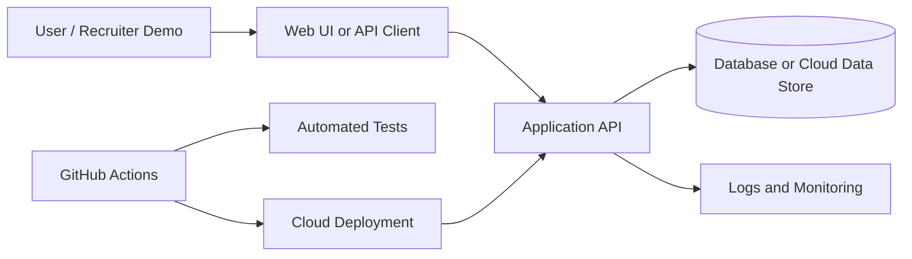
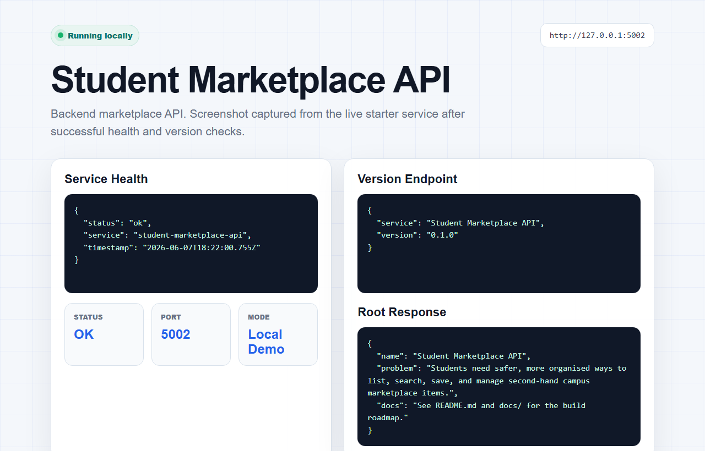

# Student Marketplace API


## Graduate Programme Fit

This project is built to show backend software engineering beyond coursework: API design, workflow rules, validation, ownership checks, documentation, Docker-ready setup, and tests around the logic that matters. It is a practical example of turning a real student problem into a maintainable service.

## How To Review This Project

1. Run `npm test` to check the marketplace business rules.
2. Read `src/marketplaceRules.js` for ownership, pricing, listing, and offer logic.
3. Review `docs/API.md` for the planned REST surface.
4. Review `docs/ARCHITECTURE.md` and `docs/TESTING.md` for design and test decisions.

## Status

MVP complete. The current version focuses on testable backend rules, API structure, documentation, and deployment readiness rather than a polished frontend.

## Level

Backend/API focused

## Problem It Solves

Students need safer, more organised ways to list, search, save, and manage second-hand campus marketplace items.

## Target Roles

Backend Developer, Software Developer, Full Stack Developer

## Tech Stack

Node.js, Express, PostgreSQL, JWT, Docker, Swagger, Jest

## Key Features

- JWT-based auth structure
- Listings, categories, saved listings, and offers
- Input validation
- OpenAPI documentation
- Dockerised local development
- Unit and integration test plan

## System Architecture



## Folder Structure

```text
.
|-- README.md
|-- LICENSE
|-- CONTRIBUTING.md
|-- .env.example
|-- .gitignore
|-- .github/
|   |-- workflows/
|   |-- PULL_REQUEST_TEMPLATE.md
|   |-- ISSUES.md
|   |-- MILESTONES.md
|   |-- LABELS.md
|-- docs/
|   |-- API.md
|   |-- ARCHITECTURE.md
|   |-- DEPLOYMENT.md
|   |-- SECURITY.md
|   |-- TESTING.md
|-- screenshots/
|-- src/
|-- test/
```

## Database Schema

```text
users(id, name, email, password_hash, role, created_at)
categories(id, name, slug)
listings(id, seller_id, category_id, title, description, price_cents, status, created_at)
saved_listings(id, user_id, listing_id, created_at)
offers(id, listing_id, buyer_id, amount_cents, status, created_at)
```

## API Endpoints

- `POST /auth/register`
- `POST /auth/login`
- `GET /listings`
- `POST /listings`
- `GET /listings/:id`
- `PATCH /listings/:id`
- `POST /listings/:id/offers`
- `POST /listings/:id/save`

## Cloud Deployment Plan

Deploy API to Render, Railway, Fly.io, or Azure App Service. Use managed PostgreSQL and store JWT secret as an environment variable.

## CI/CD Pipeline

GitHub Actions runs install, lint, tests, and Swagger validation.

## Testing Strategy

Unit test validation, auth helpers, listing service, and offer rules. Integration test main routes with a test database.

## Test Snapshot

Current local result: `5` passing tests covering price validation, listing ownership, offer rules, status transitions, and project metadata.

## Security Considerations

Hash passwords, use JWT expiry, validate ownership for listing updates, rate-limit auth routes, and avoid exposing internal errors.

## Local Setup

```bash
cp .env.example .env
npm install
npm test
npm run dev
```

## Screenshots



The screenshot above was captured from the running local starter service after successful health and version checks.

## Demo Credentials

Use only local/demo credentials. Do not commit real accounts.

```text
Email: demo@example.com
Password: DemoPassword123!
```

## Resume Bullet Points

- Built a marketplace REST API with JWT authentication, listings, saved items, offers, validation, Docker support, and OpenAPI documentation.
- Designed relational models for users, listings, categories, saved items, and offer workflows.

## LinkedIn Post Caption

I built a Student Marketplace API to practise production-style backend engineering: auth, validation, relational data modelling, Docker, Swagger docs, and API testing.

## Portfolio Description

A production-style backend API for a student marketplace, focused on listing workflows, ownership checks, validation, relational data modelling, API documentation, Docker, and automated tests.

## Commit Plan

1. `chore: scaffold repository structure`
2. `docs: add architecture and deployment plan`
3. `feat: add core data models`
4. `feat: implement primary workflow`
5. `test: add validation and service tests`
6. `ci: add GitHub Actions workflow`
7. `docs: add screenshots and demo instructions`
