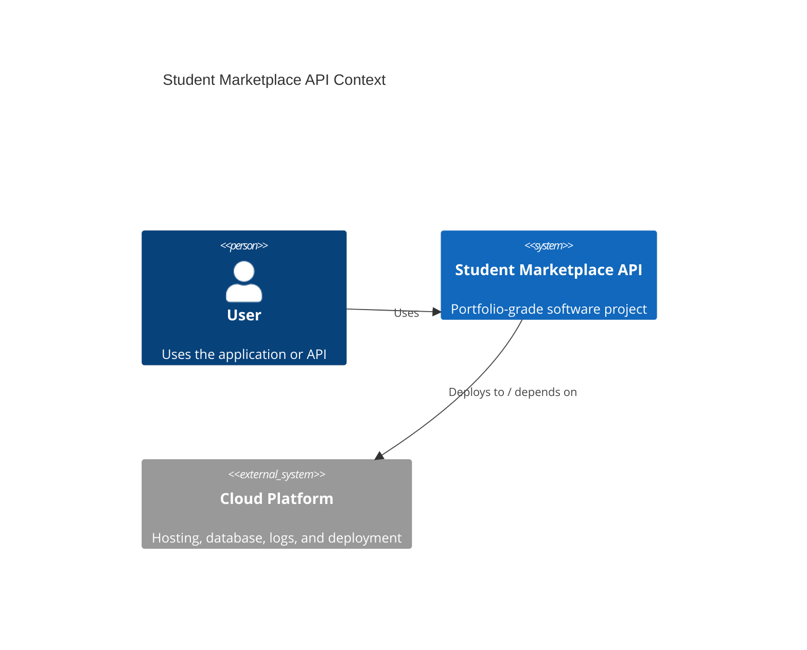

# Architecture

## Problem

Students need safer, more organised ways to list, search, save, and manage second-hand campus marketplace items.

## System Context

## Main Components

- HTTP API layer for auth, listings, saved items, and offers.
- Marketplace rules module for pricing, ownership, listing status, and offer validation.
- PostgreSQL data model for users, categories, listings, saved listings, and offers.
- OpenAPI documentation for reviewer-friendly endpoint discovery.
- Docker and GitHub Actions plan for repeatable local and CI execution.
- Deployment target using a Node host plus managed PostgreSQL.

## Engineering Tradeoffs

- Keep business rules testable outside the HTTP layer so logic can be reviewed quickly.
- Model ownership checks early because marketplace systems fail quickly when users can edit or offer on the wrong resources.
- Prefer a simple relational schema over premature microservices.
- Keep authentication planned and documented while focusing the MVP on marketplace workflow correctness.

## Next Production Improvements

- Add persistent PostgreSQL migrations with Prisma or Knex.
- Add integration tests against a disposable test database.
- Add pagination, search ranking, and moderation workflows.
- Add observability for failed validation, rejected offers, and suspicious listing activity.
