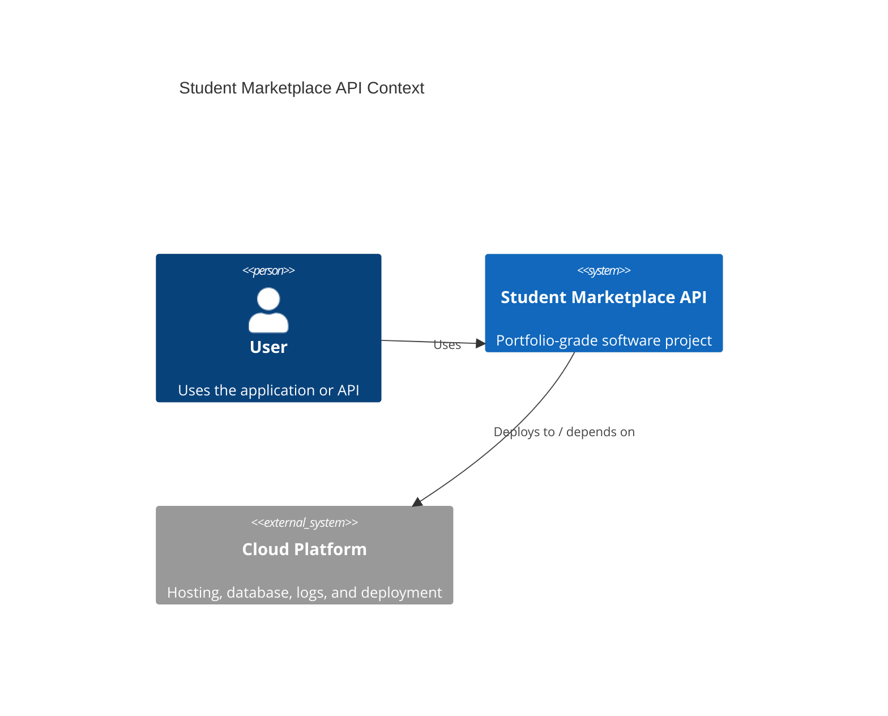

# Architecture

## Problem

Students need safer, more organised ways to list, search, save, and manage second-hand campus marketplace items.

## System Context

## Main Components

- UI or API layer
- Application service layer
- Data access layer
- Database or cloud data store
- CI/CD pipeline
- Deployment and monitoring

## Engineering Tradeoffs

- Keep the first version small enough to finish.
- Document future production improvements separately.
- Prefer boring, understandable architecture over unnecessary complexity.
